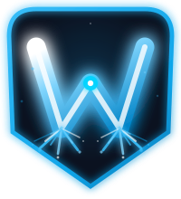
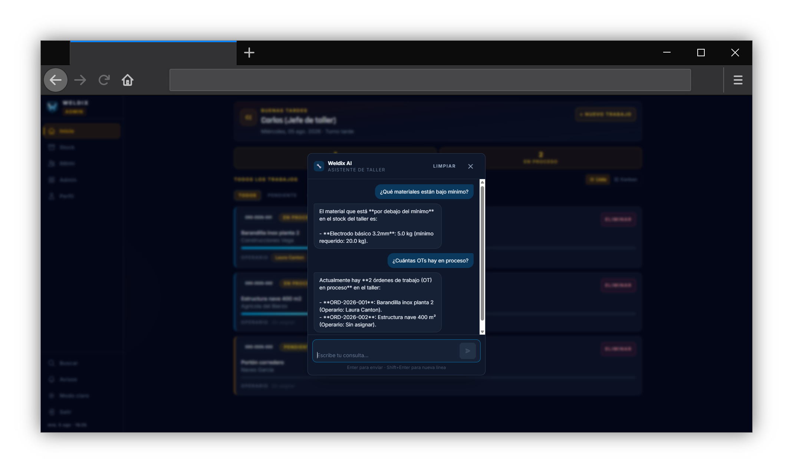
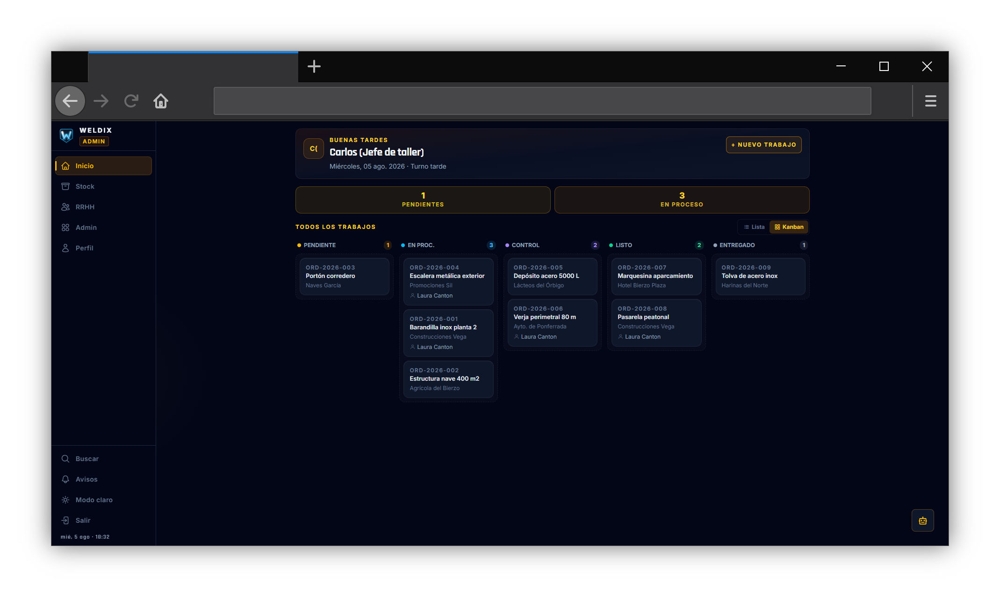
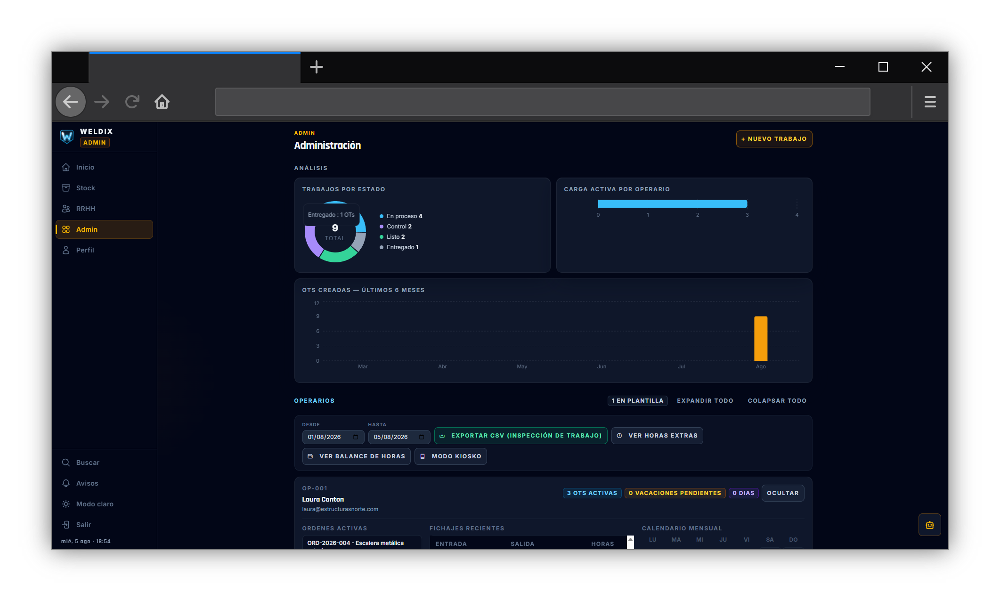
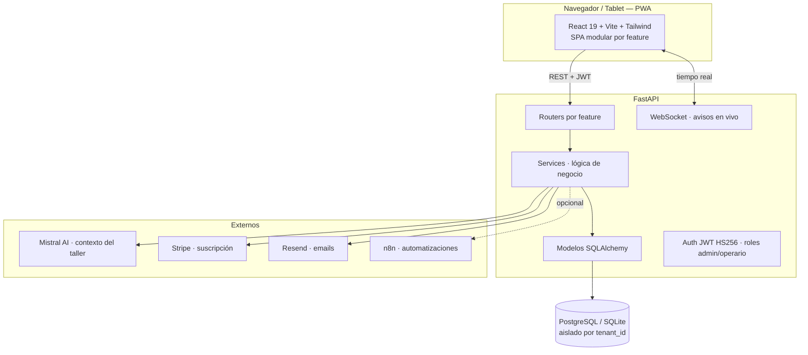

<div align="center">



# Weldix

### El sistema de gestión que entiende tu taller.

**OTs · Fichaje · Stock · RRHH · GMAO · IA · SaaS multi-taller**

[](https://www.python.org/)
[](https://fastapi.tiangolo.com/)
[](https://react.dev/)
[](https://tailwindcss.com/)
[](#)
[](#)
[](#)
[](https://github.com/fernando-delrio/weldix/actions)
[](#licencia)

[**Demo en vivo**](https://weldix-frontend.onrender.com) · [**Solicitar acceso**](mailto:hola@weldix.app) · [**Stack técnico**](#stack-completo)

<!-- TODO(dominio): cuando weldix.es apunte a Render, cambia la URL de "Demo en vivo" a https://weldix.es -->

</div>

<div align="center">



<sub>El asistente IA responde sobre el <b>stock y las órdenes reales</b> del taller — filtrado por rol y por taller, no un chatbot genérico.</sub>

</div>

---

## ▶️ Demo en vídeo (2-3 min)

El asistente IA respondiendo con **datos reales del taller** — stock, órdenes de trabajo, mantenimiento y vacaciones, en lenguaje natural.

<!-- TODO: sustituir por la miniatura + enlace de YouTube al grabar la demo -->
[](https://youtube.com/watch?v=TU_VIDEO_ID)

---

## Índice

[El problema](#el-problema) · [Qué hace](#qué-hace) · [El asistente IA](#-el-asistente-ia-del-taller) · [Capturas](#capturas) · [Arquitectura](#arquitectura) · [Arranque](#arranque-en-5-minutos) · [Stack completo](#stack-completo) · [Por qué este stack](#por-qué-este-stack-y-no-otro) · [Seguridad](#seguridad) · [Hoja de ruta](#hoja-de-ruta)

---

## El problema

En la mayoría de talleres de soldadura y calderería, la gestión sigue igual que hace 20 años: papel, Excel, llamadas de teléfono. Las órdenes se pierden. El stock se gestiona de memoria. Las horas se calculan a mano al final del mes.

**Weldix lo digitaliza todo, sin complicarlo.**

---

## Qué hace

| | Funcionalidad | Para quién |
|---|---|---|
| 📋 | **Órdenes de trabajo** — CRUD completo, flujo de 5 estados, historial de eventos | Admin + Operario |
| ⏱️ | **Fichaje** — entrada/salida desde tablet, historial, cierre forzado | Operario |
| 📦 | **Stock** — materiales, alertas de mínimos, consumos por OT | Admin + Operario |
| 👷 | **RRHH** — vacaciones, ausencias, festivos, aprobación por jefe, calendario | Equipo |
| 🔧 | **GMAO** — maquinaria del taller con semáforo de mantenimiento | Admin |
| 📸 | **Fotos** — galería antes/durante/después con lightbox por trabajo | Operario |
| 📱 | **QR Scanner** — iniciar OT desde tablet escaneando el código físico | Operario |
| 🤖 | **IA Mistral** — chat con contexto real del taller: OTs, stock, operarios | Equipo |
| 📊 | **Dashboard + gráficos** — métricas globales, donut de estados, carga por operario | Admin |
| 🗂️ | **Kanban** — vista tablero con drag & drop para mover OTs entre estados | Admin |
| 💰 | **Nóminas** — el admin sube PDFs por mes, el operario descarga las suyas | Equipo |
| 🔔 | **Avisos en tiempo real** — campana WebSocket: stock bajo, OT bloqueada, mantenimiento vencido | Equipo |
| 🌐 | **Portal cliente** — enlace público para que el cliente siga su OT sin cuenta | Cliente final |
| 🔑 | **Recuperación de contraseña** — enlace por email o reset por el admin para operarios sin correo | Todos |
| 🏢 | **Multi-tenant** — cada taller es un workspace completamente aislado | SaaS |
| 📲 | **PWA instalable** — funciona en tablet sin App Store, con caché offline | Todos |

---

## 🤖 El asistente IA del taller

No es un chatbot genérico. Responde con los **datos reales del taller, en tiempo real**, y es **consciente del rol y del taller** de quien pregunta.

**Cómo funciona (RAG de contexto):** antes de enviar la pregunta a Mistral, Weldix construye un contexto dinámico con los datos relevantes del usuario — stock, órdenes de trabajo, fichajes, equipos, vacaciones, nóminas — **filtrado por su `tenant_id` y su rol**. El modelo no adivina: responde sobre datos reales, y solo ve lo de SU taller.

| Pregunta (rol) | La IA consulta… |
|---|---|
| *"¿Qué materiales están bajo mínimo?"* (admin) | el stock real del taller |
| *"¿Cuántas OTs hay en proceso?"* (admin) | las órdenes de trabajo |
| *"¿Algún equipo con el mantenimiento vencido?"* (admin) | el GMAO |
| *"¿Cuántas vacaciones me quedan?"* (operario) | su saldo de vacaciones |
| *"¿Cuántas horas llevo esta semana?"* (operario) | sus fichajes |

**Aislamiento:** el contexto se filtra por `tenant_id` y por rol — un taller nunca ve datos de otro, y un operario solo ve lo suyo. La privacidad se garantiza en el dato que se le pasa al modelo, no solo en la UI.

---

## Capturas

| Tablero Kanban de OTs | Panel de análisis del taller |
|:---:|:---:|
| [](docs/screenshots/kanban.png) | [](docs/screenshots/dashboard.png) |
| Arrastra las OTs entre estados (drag & drop) | Métricas globales del taller en tiempo real |

---

## Flujo de una orden de trabajo

```
[admin crea OT]  →  pendiente  →  en_proceso  →  control  →  listo  →  entregado
                      ↑               ↑
               [operario escanea QR] [registra materiales + fotos + horas]
```

Cada transición queda registrada en el historial con timestamp y usuario. El jefe ve el estado de todo el taller en tiempo real, desde cualquier pantalla.

---

## Arquitectura



**Migraciones:** Alembic versiona el schema con `upgrade` / `downgrade`.
**Principios:** Feature-based vertical slicing · Strategy Pattern · Guard Clauses · SOLID · DRY · KISS

---

## Arranque en 5 minutos

[](https://render.com/deploy?repo=https://github.com/fernando-delrio/weldix)

```bash
git clone https://github.com/fernando-delrio/weldix.git && cd weldix
cp .env.example .env            # añade SECRET_KEY y MISTRAL_API_KEY

# Backend
pip install -r requirements.txt
uvicorn backend.main:app --reload

# Frontend (otra terminal)
cd frontend && npm install && npm run dev
```

**Credenciales por defecto:** `admin@weldix.com` / `admin123`

App en `http://localhost:5174` · API Docs en `http://localhost:8000/docs`

---

## Stack completo

### Backend
| Tecnología | Rol |
|---|---|
| **Python 3.11 + FastAPI** | API REST con validación automática, async nativo y docs Swagger |
| **SQLAlchemy 2 + Alembic** | ORM tipado + migraciones versionadas con rollback |
| **Pydantic v2** | Validación y serialización de entrada/salida |
| **python-jose / passlib** | JWT HS256 + hash `pbkdf2_sha256` |
| **SQLite → PostgreSQL** | SQLite en dev (cero setup), PostgreSQL en prod (mismo código vía ORM) |
| **uvicorn + wsproto** | Servidor ASGI + soporte WebSocket para avisos en tiempo real |

### Frontend
| Tecnología | Rol |
|---|---|
| **React 19 + Vite** | SPA modular por feature, HMR instantáneo, bundle tree-shaken |
| **Tailwind CSS v4** | Estilos utilitarios + theming dark/light con CSS variables |
| **React Router 7** | Rutas protegidas por rol, lazy loading, nested routes |
| **Recharts · dnd-kit · FullCalendar** | Gráficos del dashboard · Kanban drag&drop · calendario RRHH |
| **html5-qrcode · vite-plugin-pwa** | Escáner QR desde cámara · PWA instalable con caché offline |

### Integraciones e infra
| Tecnología | Rol |
|---|---|
| **Mistral AI** | Asistente con contexto real del taller (OTs, stock, operarios) |
| **Stripe** | Suscripción, trial 15 días, Checkout + webhooks firmados |
| **Resend** | Emails transaccionales: bienvenida, trial, reset de contraseña |
| **n8n (self-hosted)** | Automatizaciones opcionales: WhatsApp, Sheets, webhooks por estado |
| **GitHub Actions** | CI: lint (ESLint/Black/isort) + tests (pytest/Vitest) + bundle check |

---

## Por qué este stack y no otro

Cada elección resuelve un problema concreto de este proyecto, no una moda:

- **FastAPI, no Django ni Flask.** Django trae de más (admin, templates, su propio ORM) para lo que es una API pura; Flask trae de menos (validación, docs y async a mano). FastAPI da el punto medio: ligero, pero con validación Pydantic, async y Swagger gratis.
- **SQLAlchemy + Alembic, no SQL a mano.** El ORM parametriza las queries (defensa nativa contra inyección) y Alembic versiona el schema con `upgrade`/`downgrade`. Sin migraciones no hay rollback ni despliegue seguro.
- **SQLite en dev, PostgreSQL en prod.** SQLite se crea solo (cero fricción para arrancar). En producción PostgreSQL aporta concurrencia real y tipos que un SaaS necesita (`TIMESTAMPTZ`, `JSONB`). El mismo código sirve para ambos porque el ORM abstrae el dialecto.
- **JWT HS256, no sesiones en servidor.** Un token stateless escala en horizontal sin *sticky sessions* ni almacén de sesiones compartido — justo lo que pide un SaaS. HS256 (secreto simétrico) basta habiendo un solo emisor.
- **React, no Vue/Svelte/Angular.** Angular pesa demasiado para esta app; Vue y Svelte son excelentes, pero React tiene el ecosistema y el mercado laboral más grandes, y su modelo de hooks encaja con la arquitectura por capas (componente → hook → service).
- **Tailwind v4, no MUI ni styled-components.** MUI impondría su estética; styled-components mete CSS-in-JS en runtime. Tailwind da velocidad y control visual total, con theming dark/light por variables CSS y **cero JS en runtime**.
- **Context + hooks, no Redux/Zustand desde el día 1.** Lo único global es la sesión (Context). El resto es estado de servidor (hook + fetch) o de URL (`useSearchParams`). Meter Redux antes de que duela sería *over-engineering* — se subirá de nivel cuando haya dolor real, no por especular.
- **Mistral, no OpenAI.** LLM europeo: los datos se procesan en la UE (GDPR más simple para un producto dirigido a talleres españoles) con buena relación coste/calidad.
- **Resend, no SMTP crudo.** SMTP a mano es dolor de configuración y problemas de entregabilidad; Resend da una API moderna y buena reputación de envío con muy poco código.
- **n8n, no automatizaciones hardcodeadas.** Los flujos (WhatsApp al cliente, resumen diario, Sheets) se cambian sin tocar ni desplegar el backend. Como Zapier, pero self-hosted: sin coste por operación y sin que los datos pasen por un SaaS ajeno.
- **WebSocket en proceso, no Redis todavía.** El manager de conexiones vive en memoria: suficiente para un worker. Redis Pub/Sub se añadirá cuando haya varios workers, no antes. Deuda técnica consciente y documentada, no accidental.

---

## Seguridad

- Contraseñas con `pbkdf2_sha256` — nunca en texto plano
- Rate limiting en login (5 intentos → 10 min), en recuperación y en registro de talleres
- Recuperación de contraseña con token de un solo uso (TTL 1 h) — sin revelar si el email existe
- Todos los endpoints validan rol antes de ejecutar
- Aislamiento por `tenant_id` — un taller no puede ver datos de otro
- CORS por variable de entorno — sin `*` en producción
- Guard de arranque en producción: aborta si el JWT es inseguro, si `/docs` queda abierto o si el origen es localhost
- Secrets en `.env` — ninguna credencial en el código

---

## Estructura del proyecto

```
weldix/
├── backend/
│   ├── core/           # config, database, security, cache, feature_flags
│   └── features/       # auth · jobs · fichaje · stock · fotos · rrhh · equipos · admin · ia · nominas · …
├── frontend/
│   └── src/modules/    # auth · jobs · dashboard · admin · stock · rrhh · equipos · ia · core · …
├── .github/workflows/  # CI: lint + tests + bundle check
├── migrations/         # Alembic — historial completo del schema
└── .env.example
```

---

## Hoja de ruta

### Completado ✅

- Gestión de OTs con flujo de 5 estados + historial de eventos
- Dashboard admin con gráficos (Recharts): donut estados, carga operario, OTs por mes
- Vista Kanban con drag & drop para cambiar estado de OTs (dnd-kit)
- Control de stock con alertas de mínimos y registro de consumos
- Fichaje de jornada con historial y cierre forzado por admin
- Registro de horas imputadas por OT y resumen por operario
- Galería de fotos por trabajo (antes / durante / después)
- Escáner QR para iniciar OT desde tablet
- GMAO: gestión de maquinaria con semáforo de mantenimiento
- Módulo RRHH: ausencias, vacaciones, festivos, calendario (FullCalendar)
- Nóminas: admin sube PDFs, operario descarga las suyas por mes y año
- Asistente IA con contexto real del taller (Mistral)
- Multi-tenant: workspace aislado por taller
- Onboarding wizard de 5 pasos para nuevos admins
- PWA instalable con caché offline (vite-plugin-pwa)
- Tema dark / light con toggle global — CSS variables Tailwind v4
- Emails transaccionales con Resend: bienvenida, aviso de trial, recuperación de contraseña
- Recuperación de contraseña: enlace por email + reset por el admin para operarios sin correo
- Stripe integrado: suscripción, trial 15 días, webhook de confirmación de pago
- Landing page pública (`/`) con hero, features y precios
- Trial automático de 15 días + página `/trial-expirado` con CTA de contratación
- WebSocket: campana de avisos en tiempo real (stock bajo, OT bloqueada, mantenimiento)
- Portal cliente: enlace público `/seguimiento/:token` para seguir la OT sin cuenta
- PDF del parte de trabajo descargable
- CI/CD con GitHub Actions (lint + tests + bundle size check)
- Páginas legales: Términos, Privacidad (GDPR)

### Próximo

- [ ] Factura PDF con IVA, número de serie y logo del taller
- [ ] Notificaciones n8n: WhatsApp/Email al cliente por cambio de estado de OT
- [ ] Firma digital del cliente al recibir el trabajo
- [ ] Kanban con métricas avanzadas y filtros guardados

---

## Autor y contacto

**Fernando Del Rio** — 10 años en el sector de soldadura y calderería, en transición a desarrollo full-stack.

- Email: [fernandogondelrio@gmail.com](mailto:fernandogondelrio@gmail.com)
- Demo o consultas: [hola@weldix.app](mailto:hola@weldix.app)

---

## Licencia

Copyright (c) 2026 Fernando Del Rio. Todos los derechos reservados.

Código visible con fines de evaluación técnica y portfolio. La visibilidad del repositorio no implica ninguna licencia de uso, copia ni distribución. Para licencia comercial: [fernandogondelrio@gmail.com](mailto:fernandogondelrio@gmail.com)
